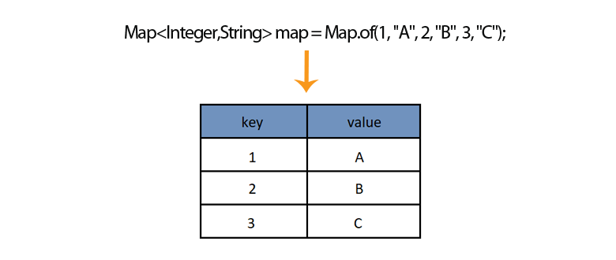

# ARREGLOS Y LISTAS
Los arreglos (arrays) y las listas (lists) son estructuras de datos que permiten almacenar múltiples elementos.

| Característica     | Array                                                            | List                                                                           |   
|--------------------|------------------------------------------------------------------|--------------------------------------------------------------------------------|
| `Tamaño`           | `Fijo`. No puede cambiar su tamaño una vez que ha sido definido. | `Dinámico`. Puede cambiar su tamaño según sea añada o eliminen sus elementos.  |
| `Tipos de datos`   | Puede almacenar tanto datos primitivos como objetos.             | Solo puede almacenar objetos.                                                  |
| `Métodos`          | -                                                                | Proporciona métodos útiles como `add(), remove(), get(), size()`, etc.         |
| `Implementaciones` | -                                                                | `List` es una interface de Java, y las implementación más común es `ArrayList` |

## Tamaño, valor e índice


## Ejemplo de arrays

> Declarar un arreglo y asignarle un valor a sus índices 
> ```java
> int[] names = new String[5];   // declarar un arreglo de cadenas con 5 elementos
> names[0] = "Jhon";             // asignar valor al primer elemento
> names[1] = "Will";             // asignar valor al segundo elemento
> ```
> 
> Recorrer un arreglo
> ```java
> for(String i: names) {
>   System.out.println(i);
> }
> ```

## Ejemplo de listas
> Declarar un ArrayList y añadir elementos
> ```java
> List<String> names = new ArrayList<>();  // declarar una lista
> names.add("Jhon");                       // añadir un elemento
> names.add("Will");                       // añadir otro elemento
> names.remove(0);                         // remover el elemento de la pisición 0
> ```
>
> Recorrer una lista
> ```java
> for(Integer i: numbers) {
>   System.out.println(i);
> }
> ```
> Convertir array en lista
> ```java
> String[] namesArray = {"Fabian", "Omar", "Jhunior"};
> List<String> namesList = new ArrayList<>(Arrays.asList(namesArray));
> ```

---

# MAPAS
Los mapas (Maps) son estructuras de datos en Java que permiten almacenar pares de clave-valor. 
Cada clave en el mapa es única y se asocia a un único valor, pero un valor puede estar asociado a múltiples claves.

| Característica     | Array                                                                                           |
|--------------------|-------------------------------------------------------------------------------------------------|
| `Tamaño`           | `Dinámico`. Puede crecer y reducir su tamaño según se añadan o eliminen elementos.              |
| `Tipos de datos`   | Solo puede almacenar objetos en la clave y el valor.                                            |
| `Métodos`          | Proporciona métodos útiles como `put()`, `get()`, `remove()`, `containsKey()`, `values()`, etc. |
| `Implementaciones` | Map es una interfaz de Java. Las implementaciones más común es HashMap.                         |

## Clave valor


## Ejemplo de maps
> Declarar un HashMap y añadir elementos
> ```java
> Map<Integer, String> usersDniMap = new HashMap<>();  // declarar un HashMap
> usersDniMap.put(76517360, "Fabian");                 // añadir un par clave-valor
> ```
> 
> Acceder a un valor por su clave
> ```java
> String name = usersDniMap.get(76517360);              // obtener el valor asociado con la clave 76517360
> System.out.println("El dueño del DNI es: " + name);   // imprimir el nombre asociado al DNI
> ```
>
> Recorrer los elementos del mapa
> ```java
> for (Map.Entry<Integer, String> entry : usersDniMap.entrySet()) {
>   System.out.println("clave:" + entry.getKey() + ", valor: " + entry.getValue());
> }
> ```
> 
> Verificar si existe una clave en el mapa
> ```java
> boolean containsDni = usersDniMap.containsKey(76517360);
> if (!containsDni) {
>   throw new IllegalArgumentException("El DNI provisto no está en el mapa");
> }
> ```
